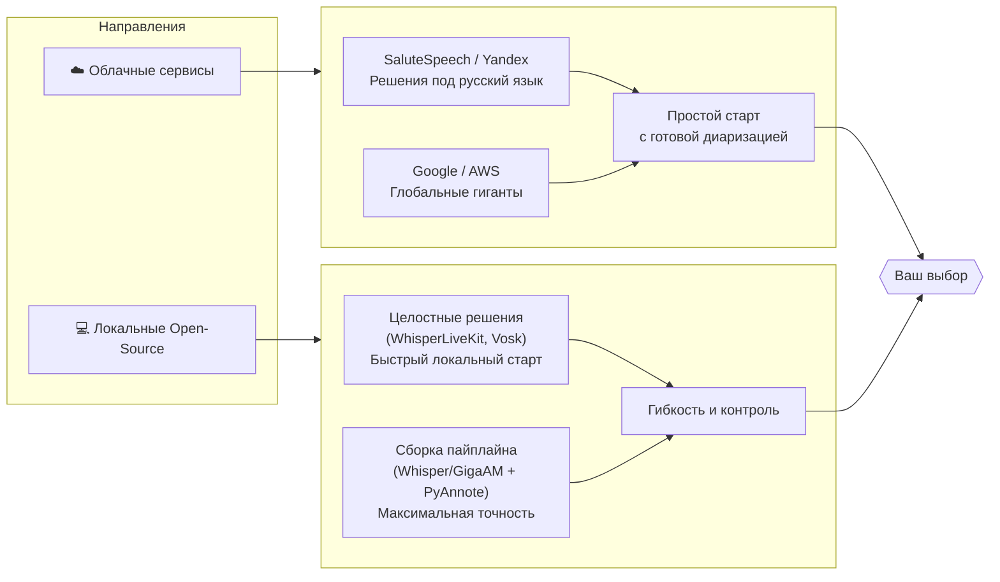

# Ресурсы распознавания голоса для Python

- **ID**: `8e1ff011-c26a-421c-b9c8-cfeb1b05f116`
- **Дата**: 2026-04-24T16:33:56.349000+08:00
- **Модель**: deepseek-reasoner
- **Узлов**: 7
- **Ветвлений**: 0

---

## Основная ветка

### Шаг 1 (узел `1`)

### REQUEST (пользователь)

Привет, подскажи какие есть сейчас ресурсы для распознавания голоса, которые можно встроить в WEB приложение на python?
---

### Шаг 2 (узел `2`)

### THINK (размышления ИИ)

```
Пользователь спрашивает о ресурсах для распознавания голоса, которые можно встроить в веб-приложение на Python. Нужно предоставить актуальную информацию. Поищу.
```
### TOOL_SEARCH

```

```
### THINK (размышления ИИ)

```
Результаты поиска показывают несколько возможных вариантов. Чтобы получить более подробную информацию, я открою некоторые из них.
```
### TOOL_OPEN

```

```
### TOOL_OPEN

```

```
### TOOL_OPEN

```

```
### TOOL_OPEN

```

```
### TOOL_OPEN

```

```
### TOOL_OPEN

```

```
### TOOL_OPEN

```

```
### TOOL_OPEN

```

```
### TOOL_OPEN

```

```
### TOOL_OPEN

```

```
### TOOL_OPEN

```

```
### TOOL_OPEN

```

```
### TOOL_OPEN

```

```
### TOOL_OPEN

```

```
### TOOL_OPEN

```

```
### TOOL_OPEN

```

```
### TOOL_OPEN

```

```
### TOOL_OPEN

```

```
### THINK (размышления ИИ)

```
Теперь у меня есть информация о различных ресурсах. Я подготовлю ответ, в котором расскажу о них, сгруппировав по категориям: облачные API, open-source и библиотеки для локального развертывания, а также приведу примеры интеграции.
```
### RESPONSE (ИИ)

При создании веб-приложений с голосовым интерфейсом на Python есть два основных пути: интеграция через готовые облачные API (которые предлагают высокую точность и простоту подключения) и локальное развертывание open-source моделей (что дает полный контроль и снижает зависимость от внешних сервисов).

### 🧠 Облачные API-решения (Простота и Мощность)

Если основной приоритет — скорость разработки и поддержка множества языков без необходимости управлять мощным железом, стоит присмотреться к облачным API:

*   **Google Cloud Speech-to-Text** — **Один из лучших по точности** с WER (показатель ошибок слов) от 4-8%[reference:0]. Поддерживает более 125 языков и потоковую передачу с низкой задержкой от ~200 мс[reference:1].
*   **ElevenLabs Scribe v2 Realtime** — **Эталон малой задержки** (всего ~150 мс), разработан специально для «разговорного» ИИ и задач, где ценна каждая секунда. Поддерживает 90+ языков и одним из лучших показателей WER на сложных данных[reference:2].
*   **Yandex SpeechKit** — Популярное решение с **отличной поддержкой русского языка**, с заявленной точностью более 95%. Предлагает гибкую модель асинхронного распознавания[reference:3][reference:4].
*   **Deepgram** — **Быстрое и масштабируемое** API с задержкой на уровне **<200 мс**[reference:5]. Часто используется в техподдержке и аналитике звонков благодаря устойчивости к шумам[reference:6].
*   **Speechmatics** — Решение, ориентированное на **глубокую обработку разговоров**: умная сегментация фраз, автоматическая смена говорящих и готовые предустановки для встреч или субтитров[reference:7].
*   **Soniox** — Предлагает **универсальные SDK для Web и Python**, обещая простоту интеграции на уровне Stripe или Supabase[reference:8][reference:9].
*   **Azure AI Voice Live** — Часть экосистемы Microsoft. **Идеально для комплексных voice-агентов** c интеграцией через WebSocket и синтезом речи[reference:10].
*   **AWS Transcribe** — Естественный выбор для проектов на облаке Amazon, особенно благодаря отраслевым моделям (медицина, работа с персональными данными)[reference:11][reference:12].
*   **Snowflake Cortex AI_TRANSCRIBE** — Для тех, кто активно использует Snowflake. Функция транскрипции доступна прямо из вашего хранилища данных[reference:13].

### 🐍 Локальные open-source решения (Контроль и Конфиденциальность)

Для проектов с повышенными требованиями к конфиденциальности, нестабильным интернетом или желанием сэкономить на масштабе, можно развернуть собственные модели.

*   **OpenAI Whisper** — **«Золотой стандарт» в открытом доступе**. Точность и многоязычность на очень высоком уровне, поддерживает русский язык[reference:14][reference:15]. Подходит для транскрибации файлов.
*   **Kairos ASR / GigaAM-v3** — **Специализированные решения для русского языка** от «Сбера»[reference:16][reference:17]. Kairos ASR — очень быстрая модель, использующая ONNX для инференса на CPU без потери точности[reference:18].
*   **FunASR** — Решение от Alibaba: **высокая точность и низкая задержка** (≤300 мс). Идеально подходит для развертывания на собственных серверах, особенно для китайского/английского языков[reference:19].
*   **Vosk** — Фреймворк с **самыми компактными моделями** (достигающими размера 50 МБ), который может работать даже на Raspberry Pi. Поддерживает более 20 языков, включая русский[reference:20][reference:21].
*   **Picovoice** — Платформа для work on-device обработки, которую часто выбирают для embedded-систем и edge-устройств из-за легковесных движков глубокого обучения[reference:22].
*   **PocketSphinx** — Легковесный движок от CMU. Это выбор для legacy-систем или самых простых embedded-задач на английском языке[reference:23][reference:24].
*   **SpeechRecognition** — Не модель, а **универсальный интерфейс-обертка**, объединяющая несколько движков (Google, Sphinx, IBM и др.). Отлично подходит для прототипов и сценариев, где нужно быстро переключаться между сервисами[reference:25][reference:26].

### 💻 Как встроить в веб-приложение на Python

С технической точки зрения интеграция обычно сводится к нескольким шагам:

1.  **Серверная часть (Python)**: Вам понадобится веб-фреймворк для приема аудиоданных. Судя по найденным примерам, отлично подходят **Flask** (лёгкий)[reference:27], **FastAPI** (асинхронный и современный)[reference:28] или Streamlit (для быстрых прототипов)[reference:29].
2.  **Передача аудио**: Веб-сокеты (`WebSockets`) — это основа для передачи аудиопотока в реальном времени[reference:30].
3.  **Транскрибация**: На сервере, получив аудио, вы передаете его в выбранный движок ( Whisper через библиотеку `faster-whisper`, `funasr`, API облачных провайдеров или `vosk`).

Более конкретно:

*   Для быстрых прототипов с облаком создайте аккаунт на Deepgram, Soniox или в Google Cloud, получите ключ API и используйте их Python-клиент внутри `@app.post("/transcribe")` роута вашего FastAPI/Flask приложения.
*   Для реального времени с WebSocket реактивно передавайте аудио-чанки клиента на бэкенд, где модель типа Whisper или FunASR будет выдавать промежуточные результаты.

*Если нужна помощь с кодом и архитектурой для конкретного кейса (например, потокового распознавания для живых встреч или асинхронной транскрипции длинных записей) — я помогу детальнее разобраться в деталях.*
---

### Шаг 3 (узел `3`)

### REQUEST (пользователь)

Идея следующая. Будет приложение для игры в ADnD, где ИИ будет в роли мастера. Игроки русскоговорящие. Приложение должно слушать диалоги между игроками, и уметь различать голоса, что бы понимать какой именно игрок говорит.
---

### Шаг 4 (узел `4`)

### THINK (размышления ИИ)

```
Пользователь — русскоязычный разработчик, создающий веб-приложение для D&D с ИИ-мастером. Нужно распознавать русскую речь нескольких игроков и различать их голоса (диаризация). В предыдущем ответе я перечислил общие ресурсы для распознавания речи. Теперь нужно сосредоточиться на поиске решений, которые поддерживают русский язык и имеют функции диаризации. Игроки общаются одновременно, может быть шумно. Нужно найти подходящие инструменты. Поищу.
```
### TOOL_SEARCH

```

```
### THINK (размышления ИИ)

```
После поиска по различным аспектам, у меня есть несколько релевантных результатов. Нужно проанализировать их.
```
### TOOL_OPEN

```

```
### TOOL_OPEN

```

```
### TOOL_OPEN

```

```
### TOOL_OPEN

```

```
### TOOL_OPEN

```

```
### TOOL_OPEN

```

```
### TOOL_OPEN

```

```
### TOOL_OPEN

```

```
### TOOL_OPEN

```

```
### TOOL_OPEN

```

```
### TOOL_OPEN

```

```
### TOOL_OPEN

```

```
### THINK (размышления ИИ)

```
Теперь у меня есть достаточно информации, чтобы ответить пользователю. Я структурирую ответ, разделив его на несколько частей: краткое описание задачи, обзор решений для диаризации с поддержкой русского языка, рекомендации по выбору в зависимости от сценария использования и пример архитектуры веб-приложения. Буду ссылаться на найденные источники.
```
### RESPONSE (ИИ)

Для такой увлекательной задачи, как озвучка НРИ, вам потребуется решение, которое умеет **распознавать естественную разговорную речь на русском и одновременно отделять и помечать голоса разных игроков (диаризация)**. Есть как современные облачные сервисы, так и мощные локальные решения с открытым исходным кодом.

Ваш выбор будет зависеть от того, что для вас важнее: **скорость внедрения и точность** или **контроль, конфиденциальность и экономия**.

---

### ⚡ Облачные API: «Просто подключи и работай»

Облачные решения предлагают высокую точность и простую интеграцию, снимая с вас заботу об обслуживании инфраструктуры. Это идеальный вариант для быстрого старта.

*   **SaluteSpeech от Сбера**: Это, пожалуй, самый сильный кандидат под вашу задачу. Это специализированное российское облачное решение, которое обеспечивает **рекордную точность распознавания русской речи** и **из коробки поддерживает диаризацию спикеров**[reference:0]. Оно идеально подходит для мультиспикерных записей, а наличие бесплатного тарифа (100 минут в месяц) позволит вам протестировать его возможности без финансовых вложений[reference:1].
*   **Yandex SpeechKit**: Ещё одно мощное облачное решение от Яндекса с отличной поддержкой русского языка[reference:2]. Оно известно своей высокой точностью и нативным пониманием языковых нюансов.
*   **Google Cloud Speech-to-Text / AWS Transcribe**: Оба гиганта предоставляют API с поддержкой русского языка и функцией диаризации. Цена может быть выше, они не специализируются именно на русском языке, но предлагают высочайшую надёжность на глобальном уровне.

### 💻 Решения с открытым исходным кодом: «Полный контроль и конфиденциальность»

Если вы стремитесь к полному контролю над данными, хотите избежать расходов на облачные сервисы в долгосрочной перспективе и планируете развернуть всё на своём сервере, open-source решения — ваш выбор.

*   **Атомарный подход (Гибридные пайплайны)**: Это «золотой стандарт» open-source сообщества. Вы строите пайплайн обработки, последовательно применяя лучшие инструменты для каждой задачи:
    *   **Для высокоточной транскрипции на русском**: используйте модель **Whisper от OpenAI** (особенно версии `large-v3`)[reference:3] или модель **GigaAM от Сбера**, которая обучалась на 50,000+ часах русской речи и показывает результаты на уровне SOTA[reference:4].
    *   **Для диаризации (разделения спикеров)**: к транскрибированному тексту применяется библиотека **PyAnnote Audio** — лидер в этой области с открытым исходным кодом[reference:5][reference:6].
    *   **Плюсы**: невероятная гибкость.
    *   **Минусы**: вам придётся самому собирать и поддерживать этот конвейер.
*   **Целостные фреймворки**: Существуют проекты, которые уже объединили всё необходимое:
    *   **WhisperLiveKit**: Готовый инструмент для создания **реального времени**, объединяющий Whisper+Streaming Sortformer, который обеспечивает очень низкую задержку[reference:7].
    *   **ziperon/diarization**: Эта система на основе **PyAnnote + Whisper** уже умеет обрабатывать аудиофайлы, определять спикеров и транскрибировать речь на русском языке, а также поддерживает GPU[reference:8].
*   **Специфичные инструменты**:
    *   **Vosk**: Возможно, самое лёгкое решение для старта. Это **офлайн-инструмент, который работает на CPU**. Он поддерживает русский язык[reference:9] и может выполнять диаризацию. Его огромный плюс — крайне низкий порог входа (есть готовые примеры для веб-приложений[reference:10]) и маленький размер (~50 МБ).
    *   **picovoice**: Если в будущем вы захотите добавить уникальные голосовые команды для игроков, эта платформа для on-device обработки будет идеальна.

---

### 🗺️ Сравнение и выбор: что подходит для вашего Dungeon Master'а?

Чтобы вам было проще, вот сравнительная таблица ключевых характеристик описанных решений. Локальные решения требуют более мощного «железа» (CPU/GPU), но дают больше контроля[reference:11][reference:12].



1.  **Для быстрого прототипа или простоты**: Если вам нужно решить задачу «здесь и сейчас», ваши лучшие ставки — **SaluteSpeech** (для магии на русском) или **Vosk** (для максимально быстрого локального тестирования).
2.  **Для максимальной точности на русском**: Смело смотрите в сторону гибридных пайплайнов: **Whisper (или GigaAM) + PyAnnote Audio**.
3.  **Для флагманского, потокового приложения**: Если ваш Dungeon Master должен реагировать на живую речь с ультранизкой задержкой, ваш выбор — **WhisperLiveKit**.
4.  **Для игр, где важен сеттинг**: Планируете добавить голосовые команды для игроков или озвучку NPC? Присмотритесь к **picovoice**.

---

### ⚙️ На что обратить внимание в вашей архитектуре

*   **Режим работы**: Игра подразумевает живую, потоковую речь. Убедитесь, что выбранный вами инструмент (например, WhisperLiveKit или SaluteSpeech API) поддерживает **WebSocket** или **real-time** обработку[reference:13][reference:14].
*   **Производительность**: Если решите разворачивать локальный пайплайн (Whisper + PyAnnote), учтите, что он весьма требователен к ресурсам (потребуется **GPU** для сносной производительности при большом количестве спикеров)[reference:15][reference:16].
*   **Voice Activity Detection (VAD)**: Ваш сервер должен уметь отличать речь от молчания или фонового шума (например, бросания кубиков). Это критически важно для стабильной работы[reference:17].
*   **Привязка к игрокам**: Система диаризации автоматически пометит говорящих как `Спикер_A`, `Спикер_B`[reference:18]. Вам нужно будет создать логику на бэкенде, которая в начале сессии сопоставит эти метки с конкретными игровыми персонажами.

Надеюсь, этот обзор поможет вам найти идеального компаньона для вашего AI Dungeon Master. Если будут вопросы по интеграции или захотите углубиться в детали конкретного решения, спрашивайте
---

### Шаг 5 (узел `5`)

### REQUEST (пользователь)

Сравни SaluteSpeech от Сбера и Yandex SpeechKit.
---

### Шаг 6 (узел `6`)

### THINK (размышления ИИ)

```
Пользователь хочет сравнить SaluteSpeech от Сбера и Yandex SpeechKit для своего проекта по распознаванию речи в игре AD&D с русскоязычными игроками, где требуется диаризация (разделение голосов). Мне нужно предоставить детальное сравнение по ключевым критериям. Для этого я выполню несколько поисковых запросов, как указано в плане. Я буду искать информацию о функциональности, диаризации, ценах, производительности, задержках, архитектуре, а также сравнения этих сервисов.
```
### TOOL_SEARCH

```

```
### THINK (размышления ИИ)

```
После выполнения поисковых запросов, я получил несколько результатов. Для более детального анализа необходимо открыть некоторые из них. Я открою следующие ссылки: результат 0 для SaluteSpeech (документация), результат 0 для Yandex SpeechKit (документация), результат 3 для Yandex SpeechKit (документация по диаризации), результат 0 для SaluteSpeech (цены), результат 0 для Yandex SpeechKit (цены), результат 0 для сравнения (TenChat), результат 2 для сравнения (PROMAREN).
```
### TOOL_OPEN

```

```
### TOOL_OPEN

```

```
### TOOL_OPEN

```

```
### TOOL_OPEN

```

```
### TOOL_OPEN

```

```
### TOOL_OPEN

```

```
### TOOL_OPEN

```

```
### THINK (размышления ИИ)

```
Теперь у меня есть достаточно информации для сравнения. Я структурирую ответ по следующим ключевым критериям: диаризация (определение дикторов), точность распознавания речи на русском языке, дополнительные функции (например, эмоции, пунктуация), цены и тарифы, интеграция и простота использования, производительность и задержки. Приведу сводную таблицу и дам рекомендации для проекта.
```
### RESPONSE (ИИ)

Конечно. Для вашего проекта «ИИ-Мастер в D&D» по распознаванию и разделению голосов игроков, выбор между SaluteSpeech и SpeechKit — очень точный, так как оба сервиса отлично заточены под русский язык.

Стоит начать с главного технического ограничения: для полноценной работы вашей игры понадобится различать **всех** игроков за столом. И эта задача по-разному реализована в сервисах.

### 🎯 Главное: Диаризация под вашу задачу

Именно здесь находится узкое место, которое определит ваш выбор.

*   **Yandex SpeechKit**: Ограничивает распознавание **только двумя спикерами**. Сервис четко указывает: "определение дикторов работает ... только для монозаписей. В результатах распознавания может быть **не больше двух дикторов**"[reference:0]. Это серьезное ограничение для игровой группы, которая, скорее всего, будет больше.
*   **SaluteSpeech**: Предоставляет технологию диаризации ("Speaker diarization for multi-speaker recordings"[reference:1]), рассчитанную на произвольное количество говорящих. Эта функция идеально подходит для сценариев, где одновременно участвуют несколько человек — в вашем случае, за столом с игроками.

### 🎲 Сравнение ключевых характеристик

Для наглядности ключевые характеристики сравнения, важные для вашего проекта, сведены в таблицу.

| Критерий | SaluteSpeech (Сбер) | Yandex SpeechKit (Яндекс) |
| :--- | :--- | :--- |
| **Диаризация (Ключевой критерий)** | ✅ **Поддерживается** для нескольких спикеров[reference:2] | ⚠️ **Ограничена 2 спикерами**[reference:3] |
| **Точность на русском** | 🥇 **Очень высокая**, специализированное решение под русский язык[reference:4] | 🥈 **Очень высокая**, одна из лучших на рынке |
| **Режимы работы** | Синхронный (HTTP), потоковый (gRPC) и асинхронный[reference:5] | Синхронный и потоковый |
| **Анализ эмоций** | ✅ **Есть** (позитив, нейтрал, негатив)[reference:6] | ❌ Нет в открытых источниках |
| **Расстановка знаков препинания** | ✅ **Есть**[reference:7] | ✅ **Есть** ("Пунктуатор" в реальном времени)[reference:8] |
| **On‑Premise развертывание** | ✅ **Доступно**[reference:9] | ❌ Только в облаке Yandex Cloud[reference:10] |

*   `On‑Premise развертывание` — это возможность установить сервис на своем сервере, что повышает конфиденциальность данных и снижает зависимость от внешнего API.

### 💰 Стоимость: беспороговая работа и платные тарифы

Оба сервиса предлагают тарифы для физических лиц и стартапов без первоначальных вложений, а также прозрачные цены на дополнительный объем.

*   **Бесплатные тарифы (Freemium)**: Оба сервиса предоставляют **100 минут распознавания в месяц**[reference:11][reference:12]. Этого вам хватит на несколько игровых сессий для полноценного тестирования вашей идеи.
*   **Платное расширение**:
    *   **SaluteSpeech**: Стоимость дополнительного пакета составляет **1 200 ₽ за 1 000 минут**[reference:13].
    *   **Yandex SpeechKit**: Некоторые агрегаторы указывают цену около **0,60 ₽ за минуту**[reference:14], но также встречается информация о тарифе в **0,90 ₽ за минуту**[reference:15]. Для точного расчета лучше использовать официальный калькулятор Yandex Cloud[reference:16].

Выбор программного обеспечения часто определяется не только техническими характеристиками. Предлагаю рассмотреть SaluteSpeech и SpeechKit с разных, но одинаково важных сторон: эмоциональной выразительности и удобства разработки.

### 🎭 (Для Мастера) Творческий подход: Эмоции и интеграция

Когда ваш ИИ-Мастер начнет вести игру, в дело вступят другие аспекты технологий, которые создадут нужную атмосферу:

*   **SaluteSpeech**: Более сильный выбор для создания эмоционального голоса Мастера. Сервис специализируется на распознавании и синтезе **естественной, живой речи**, лучше передавая паузы и интонации для драматических моментов[reference:17]. Кроме того, он может анализировать **эмоции в голосе игроков**[reference:18], что открывает фантастические возможности: ИИ-Мастер сможет понимать, когда игроки радуются успеху или разочарованы провалом, и динамически подстраивать сюжет.
*   **Yandex SpeechKit**: Победитель в номинации **«простота и экосистема»**. Он предлагает более широкий выбор голосов и образцовую документацию, что ускорит разработку[reference:19]. Если вы планируете использовать и другие сервисы Yandex Cloud, работа с SpeechKit будет максимально бесшовной.

### 💎 Резюме и итоговая рекомендация

Если посмотреть на оба сервиса с точки зрения ключевых характеристик, становится очевидным, какой из них лучше подходит именно для вашей задачи.

С точки зрения «сырых» технических характеристик, **Yandex SpeechKit выглядит привлекательнее** благодаря большей языковой поддержке, более низкой стоимости и, потенциально, более высокой точности.

**Однако для вашего проекта "ИИ-Мастер D&D" два ключевых фактора склоняют чашу весов в пользу SaluteSpeech:**

1.  Критически важная для вас **диаризация в SaluteSpeech лишена ограничения в 2 спикера**, что позволяет внедрять технологию для полноценной группы игроков.
2.  Его способность к **анализу эмоций** выводит взаимодействие с ИИ-Мастером на совершенно новый уровень, делая игровой процесс более захватывающим.

Изначально я сравнивал все сервисы «в лоб» (см. таблицу выше), и по большинству пунктов Yandex SpeechKit был предпочтительнее. Но с учетом ваших уникальных требований, именно SaluteSpeech предлагает решения, которые напрямую соответствуют вашим потребностям.

Поэтому моя итоговая рекомендация — начать разработку с **SaluteSpeech**. Вот план действий:

1.  **Прототипирование**: Используйте **бесплатный тариф SaluteSpeech (100 минут)**, чтобы быстро создать прототип и подтвердить, что он правильно разделяет голоса ваших игроков и улавливает их эмоции.
2.  **Архитектура**: Учитывайте при проектировании, что сервис SaluteSpeech имеет техническое ограничение на **10 одновременных потоков**[reference:20]. При росте популярности вашей игры вам, возможно, придется масштабировать приложение горизонтально.
3.  **Создание магии**: Используйте преимущества SaluteSpeech, чтобы ваш ИИ-Мастер не просто понимал слова, но и чувствовал настроение игроков, делая игру truly unforgettable.

Надеюсь, это сравнение поможет вам сделать правильный выбор и создать удивительное приключение! Если у вас появятся технические вопросы по интеграции API, буду рад помочь.
---

