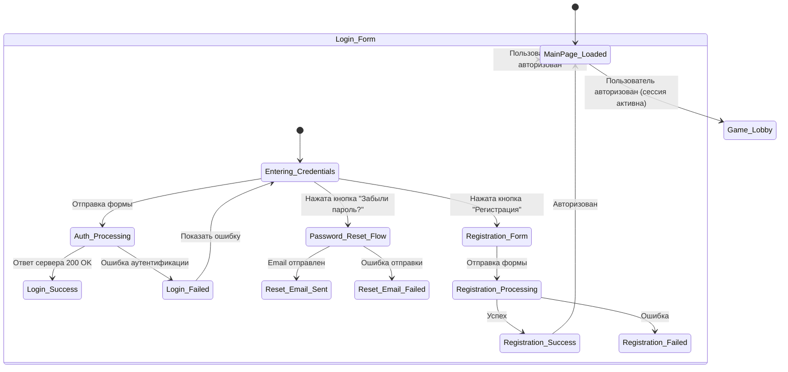

# Систематизация логики веб игры

- **ID**: `8bd28a54-8fcc-4ae8-bc44-91aa984e9e02`
- **Дата**: 2026-05-15T06:45:16.431000+08:00
- **Модель**: deepseek-reasoner
- **Узлов**: 9
- **Ветвлений**: 0

---

## Основная ветка

### Шаг 1 (узел `1`)

### REQUEST (пользователь)

Привет. У меня есть веб игры. И я сейчас столкнулся с тем, что просто текстом оформлять её логику и структуру крайне не удобно. Поясню на примере. Начинаем с самого простого. Пользователь вводит в адресной строке адрес сайта. Идёт запрос на сервер, сервер обрабатывае и отдаёт данные главной страницы. Пользователь видет главную страницу и предложение ввести логин и пароль, а так же кнопку зарезервироваться или восстановить пароль. Или если в кэше есть данные о входе, выводится вразу вход в игру и т.д. вот такие если и ветвлений и подпунктов становится очень много. Какие есть практики и правила как это все систематизируют, как описывают, как вообще правильно вести разработку идей к продукту?
---

### Шаг 2 (узел `2`)

### THINK (размышления ИИ)

```
Пользователь — разработчик веб-игр, который столкнулся со сложностью описания разветвленной логики и структуры проекта в виде текста. Он хочет узнать, какие существуют практики, правила и методы систематизации, описания и ведения разработки от идеи до продукта.

Мне нужно дать ответ, который охватит:
- Языки визуального моделирования: UML (диаграммы деятельности, состояний, последовательности, прецедентов), BPMN, IDEF.
- Инструменты: draw.io, Lucidchart, PlantUML.
- Методологии проектирования: user stories, use cases, Event Storming, State Machines.
- Паттерны проектирования: State, Strategy, Command.
- Фреймворки и игровые движки, которые упрощают управление состояниями.
- Инструменты для управления проектами: Jira, Confluence.
- Практики документирования: "живая документация", C4 model, arc42.

Нужно дать практические рекомендации, как перейти от текстового описания к структурированному, возможно, с примерами для игрового веб-приложения.

Также стоит упомянуть, что для игр часто используют конечные автоматы (Finite State Machines) и Behavior Trees. Для веб-интерфейсов — statecharts (например, XState).

Упомянуть, что важно разделять фронтенд и бэкенд, использовать API-контракты (OpenAPI).

Стоит посоветовать начать с высокоуровневого описания системы, затем детализировать логику с помощью диаграмм.

Также упомянуть инструменты для прототипирования (Figma, Balsamiq).

Поищу актуальные ресурсы.
```
### TOOL_SEARCH

```

```
### THINK (размышления ИИ)

```
После поиска у меня есть несколько релевантных результатов. Чтобы получить более полную информацию, я открою некоторые из них.
```
### TOOL_OPEN

```

```
### TOOL_OPEN

```

```
### TOOL_OPEN

```

```
### TOOL_OPEN

```

```
### TOOL_OPEN

```

```
### TOOL_OPEN

```

```
### TOOL_OPEN

```

```
### THINK (размышления ИИ)

```
Теперь у меня есть информация по различным аспектам. Я планирую структурировать ответ, охватив визуальное моделирование (UML, BPMN), паттерны проектирования (State, Strategy), инструменты (draw.io, Lucidchart, PlantUML, Mermaid), методологии (User Story Mapping, Event Storming), C4 model, XState, а также практические рекомендации для игр. Также стоит упомянуть о веб-специфичных инструментах, таких как BPMN для высокоуровневых процессов и диаграммы последовательностей для детализации API. Приведу примеры для веб-игр. Ответ будет дан на русском языке.
```
### RESPONSE (ИИ)

Знакомая ситуация: когда логика усложняется, текстовые описания перестают работать и начинают только запутывать. Вы на верном пути — пора переходить к визуальному моделированию и структурированию. Все практики, о которых пойдёт речь, универсальны. Суть не в выборе конкретного инструмента или типа диаграмм, а в самом принципе мышления. Это системный подход, который помогает увидеть проект целиком, а не как набор разрозненных требований.

### 🧩 Фундамент: Паттерны мышления и проектирования

Прежде чем рисовать, полезно освоить два подхода, которые учат думать о логике игры нужным образом:

*   **Конечные автоматы (Finite State Machines, FSM) и Statecharts**: Это математическая модель, где система всегда находится в одном из фиксированных состояний, а переходы между ними происходят по событиям. Это основа для управления игровыми процессами. Statecharts — расширение FSM, которое позволяет вкладывать состояния друг в друга, избегая «комбинаторного взрыва»[reference:0].
*   **Паттерн «Состояние» (State Pattern)**: Поведенческий паттерн проектирования, позволяющий объекту менять поведение при изменении его внутреннего состояния. Код становится чище, исчезают громоздкие `if-else` или `switch-case`[reference:1]. Его логично применять в паре с паттерном «Стратегия» — для выбора алгоритма поведения внутри одного состояния[reference:2].

### 📊 Инструментарий: Как и чем визуализировать

Для разных задач нужны разные инструменты. Вот удобный набор для разных этапов:

1.  **Для высокоуровневого дизайна и архитектуры:**
    *   **UML (Unified Modeling Language)**: Универсальный язык, включающий:
        *   **Диаграмму активностей (Activity Diagram)**: Идеально подходит для визуализации сложных сценариев с ветвлениями, параллельными действиями и циклами[reference:3][reference:4]. Отлично подходит для описания процесса входа, о котором вы упомянули.
        *   **Диаграмму последовательности (Sequence Diagram)**: Показывает обмен сообщениями между компонентами во времени[reference:5]. Критически важна для проектирования API и понимания, как фронтенд общается с бэкендом[reference:6].
    *   **BPMN (Business Process Model and Notation)**: Отличный выбор для верхнеуровневого описания бизнес-процессов и их взаимодействия, например, обмена сообщениями между разными отделами или сервисами[reference:7][reference:8].

2.  **Для проработки игровой логики:**
    *   **Диаграммы состояний (State Diagrams)**: Основа для проектирования игры. Позволяет наглядно представить все игровые фазы: `WaitingForPlayers`, `RoundInProgress`, `GameOver` и переходы между ними[reference:9].
    *   **Stateflow (MATLAB)**: Мощный инструмент для симуляции и проектирования логики, особенно для сложных систем[reference:10]. Можно создавать иерархии и параллельные состояния, как в Тетрисе: `WaitingArea`, `MainArea`, `Draw`[reference:11].

3.  **Инструменты для рисования:**
    *   **draw.io (diagrams.net)**: Бесплатный, функциональный и очень популярный инструмент. Универсальный выбор для любых диаграмм[reference:12][reference:13].
    *   **Lucidchart**: Интуитивно понятный онлайн-сервис с широкими возможностями для совместной работы, идеален для команд[reference:14][reference:15].
    *   **PlantUML и Mermaid.js**: Это текстовые инструменты: вы пишете код, который превращается в диаграмму[reference:16]. Преимущества: диаграммы можно хранить в системе контроля версий (Git), а изменения — отслеживать.

### 🧭 Навигация по проекту: Методологии и подходы

Если в целом понятно, в каком направлении двигаться, вот несколько практических методик, которые помогут систематизировать разработку:

*   **User Story Mapping (USM) и Event Storming**: Эти техники помогают спроектировать продукт на основе пользовательского пути[reference:17].
    *   **Event Storming** — это воркшоп, где вы вместе с командой на стикерах моделируете доменные события. Это помогает быстро выявить узкие места[reference:18][reference:19].
    *   **User Story Mapping** — метод для организации пользовательских историй в наглядную карту, которая помогает увидеть весь путь пользователя и спланировать разработку[reference:20].
*   **C4 Model**: Фреймворк для документирования архитектуры, который позволяет смотреть на систему с разным уровнем детализации[reference:21]. Он состоит из четырех уровней:
    1.  **Контекст (Context)**: Ваша игра и её взаимодействие с пользователями и внешними сервисами.
    2.  **Контейнеры (Containers)**: Деплоимые части, например, фронтенд на React и бэкенд на Node.js.
    3.  **Компоненты (Components)**: Модули внутри контейнера, скажем, «Менеджер сессий» внутри бэкенда[reference:22].
    4.  **Код (Code)**: Уровень классов и интерфейсов.

### 🎮 Применяем на практике: От идеи к коду

Теперь давайте посмотрим, как эти инструменты могут помочь в вашем конкретном случае — при разработке веб-игры.

#### **1. Проектирование логики с помощью диаграмм состояний**

Давайте спроектируем логику для вашей игры, используя нотацию диаграмм состояний. Это наглядно покажет, как избавиться от путаницы в условиях.

Игровые состояния:



Что это даёт:
*   **Наглядность**: Вы и команда сразу видите все возможные пути пользователя, а не продираетесь сквозь код.
*   **Тестируемость**: Легко проверить, все ли переходы обработаны.
*   **Надёжность**: Можно убедиться, что нет «зависших» состояний, из которых нет выхода.

#### **2. Внедрение паттерна «Состояние»**

Ваш серверный код на любом языке может выглядеть так:

```python
class Game:
    def __init__(self):
        self.state = WaitingForPlayersState(self) # Начальное состояние

    def handle_event(self, event):
        self.state.handle_event(event) # Делегируем обработку текущему состоянию

class GameState(ABC):
    def __init__(self, game):
        self.game = game

    @abstractmethod
    def handle_event(self, event):
        pass

class WaitingForPlayersState(GameState):
    def handle_event(self, event):
        if event.type == 'PLAYER_JOINED' and len(self.game.players) >= 2:
            self.game.state = GameInProgressState(self.game) # Переключаем состояние
            # ... инициализация раунда
```

#### **3. Отличная практика: XState**

На фронтенде для управления сложной логикой можно использовать библиотеку **XState** для JavaScript/TypeScript[reference:23][reference:24]. Она позволяет не только описать состояния декларативно, но и имеет визуальный редактор — **Stately Studio**, где можно нарисовать диаграмму и сразу получить работающий код[reference:25][reference:26].

### 💎 Итоги и план действий

Важно понимать, что моделирование — это не просто создание картинок, а системное мышление и итеративный процесс. Вот несколько шагов, с которых можно начать:

1.  **Итеративный подход**: Начните с высокоуровневой диаграммы активностей или BPMN, затем детализируйте отдельные части с помощью диаграмм последовательности и состояний.
2.  **Совместная работа**: Обсуждайте диаграммы с командой — это помогает выявить скрытые проблемы на ранних этапах.
3.  **«Живая» документация**: Храните диаграммы в виде кода (PlantUML, Mermaid) в репозитории Git. Так документация всегда будет рядом с кодом и будет меняться вместе с ним.
4.  **Начните с чего-то одного**: Выберите один тип диаграмм для вашей текущей задачи. Например, для сценария входа идеально подойдет UML-диаграмма активностей.

Надеюсь, этот разбор поможет вам навести порядок в проекте. Если появятся вопросы по конкретным нотациям или вы захотите обсудить что-то на примере, — пишите!
---

### Шаг 3 (узел `3`)

### REQUEST (пользователь)

Отлично, диаграммы - это то что нужно. А какие есть сервисы, где можно вести диалог в чате с ИИ и обсуждать процесс, а ИИ будет рисовать, менять и наполнять диаграммы? Сервис должен иметь возможность подключить свою ии по API.
---

### Шаг 4 (узел `4`)

### THINK (размышления ИИ)

```
Пользователь спрашивает о сервисах, где можно в чате с ИИ обсуждать процесс и ИИ будет рисовать/менять диаграммы, с возможностью подключения своего ИИ через API. Мне нужно найти такие сервисы. Поищу.
```
### TOOL_SEARCH

```

```
### THINK (размышления ИИ)

```
Результатов много. Нужно отобрать сервисы, которые позволяют вести диалог с ИИ для рисования диаграмм и имеют возможность подключения своего ИИ через API. Это могут быть как готовые платформы, так и open-source проекты. Составлю список, откроем несколько наиболее релевантных.
```
### TOOL_OPEN

```

```
### TOOL_OPEN

```

```
### TOOL_OPEN

```

```
### TOOL_OPEN

```

```
### TOOL_OPEN

```

```
### TOOL_OPEN

```

```
### TOOL_OPEN

```

```
### TOOL_OPEN

```

```
### TOOL_OPEN

```

```
### TOOL_OPEN

```

```
### TOOL_OPEN

```

```
### TOOL_OPEN

```

```
### TOOL_OPEN

```

```
### TOOL_OPEN

```

```
### TOOL_OPEN

```

```
### THINK (размышления ИИ)

```
Теперь у меня есть список потенциальных сервисов. Нужно ответить пользователю, классифицировав их. Важно ответить, что не все сервисы могут подключать кастомный ИИ, но многие позволяют настраивать API ключи. Я подготовлю ответ.
```
### RESPONSE (ИИ)

Да, такие сервисы есть, и многие из них как раз строятся вокруг протокола MCP, чтобы «подружить» чаты с ИИ и редакторы диаграмм. Одна часть инструментов — это готовые приложения, где вы просто указываете свой API-ключ, а другая — конструкторы, которые можно развернуть у себя.

Если вам нужно решение, которое можно настроить под себя и встроить в свои процессы, вот несколько Open Source-проектов, с которых можно начать.

### 🛠️ Open Source: Развернуть и настроить под себя

Эти инструменты — хорошая основа для кастомизации. Их объединяет возможность указать свою модель через API-ключ и открытый исходный код:

*   **Next AI Draw.io**: Чат-интерфейс и холст draw.io. Создавайте, изменяйте и улучшайте диаграммы с помощью естественного языка. В настройках можно указать API-ключ вашего любимого провайдера (OpenAI, Anthropic, Google Gemini и др.) и модель[reference:0][reference:1].
*   **FlowPilot**: Это как Next AI Draw.io, только с расширенными функциями: распознавание стиля по картинке, возможность сравнения до 5 разных LLM, генератор презентаций[reference:2][reference:3].
*   **Smart Draw**: Позволяет выбирать между двумя движками для рисования: Draw.io (профессиональный) и Excalidraw (для творческих задач). Можно подключить свои ключи или использовать пароль администратора для доступа к серверной LLM[reference:4][reference:5][reference:6].
*   **whiteboard**: Совместная доска на базе Excalidraw. Вы и ваш ИИ-агент (Claude Code, Codex) работаете на одном холсте в реальном времени через WebSocket для синхронизации. Всё взаимодействие идёт через MCP[reference:7][reference:8].
*   **Shannon**: Локальная (local-first) «бесконечная доска» с чатом, рисунками, графиками. Вы подключаете свои ключи, а на провайдеры уходят только аутентификационные данные[reference:9].

### 🔌 «Клеевые» решения: MCP-серверы и плагины

Если у вас уже есть любимый чат (Claude Desktop, Cursor), не обязательно переезжать на новую платформу. Можно добавить нужную функцию с помощью MCP-сервера или плагина:

*   **Draw.io MCP Server**: Сервер на базе Model Context Protocol (MCP). После настройки Claude получает прямой доступ к холсту draw.io и может самостоятельно создавать, изменять, удалять фигуры и управлять слоями по вашей просьбе[reference:10][reference:11].
*   **AI Diagram Maker MCP**: Генерирует диаграммы прямо в чате, не нужно ничего скачивать — вы получаете ссылку, которую можно открыть и отредактировать[reference:12].
*   **MCP Excalidraw**: Сервер, который даёт ИИ-системам API-доступ к Excalidraw для программного создания и управления диаграммами[reference:13].

### 💎 Платные платформы и экосистемы

Для командной работы и более широких возможностей можно рассмотреть платные сервисы, которые также интегрируются с популярными чатами и имеют свои API:

*   **Lucid GPT**: Расширение для ChatGPT от создателей Lucidchart. Вы описываете диаграмму в чате, а GPT создаёт её редактируемую версию в Lucidchart[reference:14].
*   **IdeaBoard**: Приложение внутри ChatGPT, которое превращает текстовые описания в визуальные диаграммы, майнд-карты и user journey maps. Есть статичная картинка и ссылка на редактируемую версию[reference:15].
*   **Slatebox**: Платформа для коллаборации с AI-ассистентом для мозговых штурмов. Есть собственный API для кастомных интеграций и генерация диаграмм по тексту или ссылке[reference:16].

### 💎 С чего начать: пошаговый план

Чтобы не утонуть в многообразии, можно начать с малого:

1.  **Попробуйте самое простое**: Откройте **Next AI Draw.io** или **FlowPilot** в браузере, введите свой API-ключ и попробуйте описать одну из ваших сцен, например, экран входа в игру.
2.  **«Прикрутите» к своему инструменту**: Если вы работаете в VS Code, установите расширение **Mermaid** и подключите к нему **AI Diagram Maker MCP** или **Draw.io MCP Server** для генерации диаграмм.
3.  **Разверните своё**: Если душа лежит к самодельным решениям, выберите один из понравившихся open-source проектов, поднимите его локально и настройте под свою модель.

В целом, все эти решения универсальны, но если вы захотите обсудить, как применить их конкретно к архитектуре вашей веб-игры, или появятся другие вопросы — пишите, будем разбираться дальше.
---

### Шаг 5 (узел `5`)

### REQUEST (пользователь)

А https://github.com/DayuanJiang/next-ai-draw-io тут ИИ только диаграммы рисует, или может их и читать и изменять?
---

### Шаг 6 (узел `6`)

### THINK (размышления ИИ)

```
Пользователь спрашивает о функциональности конкретного инструмента next-ai-draw-io. Мне нужно собрать информацию о его возможностях: умеет ли он только рисовать, или также читать и изменять существующие диаграммы. Для этого я выполню несколько поисковых запросов и открою страницу проекта на GitHub.
```
### TOOL_SEARCH

```

```
### TOOL_OPEN

```

```
### THINK (размышления ИИ)

```
После выполнения поисковых запросов и открытия страницы проекта на GitHub, я получил информацию о функциональности next-ai-draw-io. В результатах поиска и на странице GitHub указано, что приложение позволяет создавать, изменять и улучшать диаграммы с помощью естественного языка. Также упоминается возможность загрузки изображений для репликации диаграмм. Теперь мне нужно ответить пользователю, что next-ai-draw-io умеет не только рисовать, но и читать и изменять диаграммы. Для полной уверенности стоит также открыть страницу с документацией или FAQ.
```
### TOOL_OPEN

```

```
### THINK (размышления ИИ)

```
Прокрутив страницу, я не увидел непосредственно раздела с описанием функций. Возможно, он находится выше. Я открою страницу с начала.
```
### TOOL_FIND

```

```
### THINK (размышления ИИ)

```
Теперь откроем строки с описанием функций.
```
### TOOL_OPEN

```

```
### THINK (размышления ИИ)

```
Теперь у меня есть достаточно информации, чтобы ответить пользователю. В описании функций указано, что next-ai-draw-io позволяет создавать и изменять диаграммы, загружать существующие диаграммы для репликации и улучшения, а также имеет историю диаграмм. Это означает, что он может "читать" и изменять диаграммы. Ответ будет структурирован следующим образом: я объясню, что next-ai-draw-io умеет не только рисовать, но и читать, и изменять диаграммы, приведу цитаты из документации.
```
### RESPONSE (ИИ)

Да, `next-ai-draw-io` умеет и читать, и изменять существующие диаграммы. Это не просто генератор картинок по описанию, а инструмент для совместной работы человека и ИИ. Его ключевая особенность в том, что результат всегда остается редактируемым, что позволяет дорабатывать его вручную после ИИ.

Вот как это работает:

* **Чтение и анализ**: Вы можете загрузить уже существующую диаграмму или любое изображение, и ИИ проанализирует его. Он способен «реплицировать и улучшать» загруженные диаграммы, превращая их в полностью редактируемые схемы Draw.io[reference:0].
* **Модификация**: Все созданные или загруженные диаграммы — это не статичная картинка, а стандартный XML-файл Draw.io. После генерации вы можете попросить ИИ изменить любой элемент: «Замени сервер на иконку базы данных», «Добавь слой для кэша» и так далее[reference:1]. Интерфейс позволяет общаться с ИИ в чате, чтобы итеративно дорабатывать схему[reference:2].
* **История изменений**: В приложении есть функция контроля версий, которая отслеживает все правки и позволяет в любой момент откатиться к предыдущей версии диаграммы[reference:3].

Получается, что вы можете начать с грубого наброска или загрузить скриншот старой схемы, попросить ИИ привести ее в порядок, а затем в несколько итераций доработать до финального вида. 

Если появятся вопросы по его настройке под свою модель, спрашивайте.
---

### Шаг 7 (узел `7`)

### REQUEST (пользователь)

А я могу словами описывать логику игры, как я тебе в начале чата описал, а ИИ начнёт строить диаграмму?
---

### Шаг 8 (узел `8`)

### THINK (размышления ИИ)

```
Мы должны ответить пользователю. Вопрос: может ли next-ai-draw-io строить диаграммы по словесному описанию логики игры, как он ранее описал (вход, регистрация, восстановление пароля и т.д.). В предыдущем ответе мы уже упомянули, что он умеет читать, изменять и генерировать диаграммы, в том числе по описанию. Нужно подтвердить и уточнить, что да, можно описать логику словами, и он построит диаграмму (например, блок-схему или диаграмму состояний). При этом указать, что это редактируемая диаграмма, можно итеративно уточнять. 

Структура ответа: краткое "Да", затем пояснение, как это работает, пример, и упоминание, что именно для игровой логики можно использовать state-диаграммы. Также можно отметить, что в next-ai-draw-io можно управлять стилем диаграммы через указание типа (flowchart, UML и т.д.). 

Пользователь спрашивает конкретно про next-ai-draw-io, но мы можем также упомянуть, что для этого подходят и другие сервисы, но суть вопроса именно про этот проект. 

Ответ должен быть полезным, ободряющим.
```
### RESPONSE (ИИ)

Да, именно так это и работает. Вы можете словами описать всю логику из нашего первого сообщения — и `next-ai-draw-io` превратит её в редактируемую диаграмму.

Вам не нужно рисовать фигуры или соединять стрелки. Достаточно описать процесс естественным языком, например:

> «Пользователь вводит адрес сайта. Идёт запрос на сервер. Сервер отдаёт главную страницу. Пользователь видит форму входа с логином и паролем, а также кнопки “Регистрация” и “Забыли пароль?”. Если в кэше есть данные о входе, сразу показывается экран входа в игру».

ИИ проанализирует этот текст и построит на холсте **блок-схему (flowchart)** или **UML-диаграмму активностей** — в зависимости от того, что вы попросите (можно явно сказать «нарисуй UML state diagram» или «сделай блок-схему процесса входа»).

**Что особенно удобно для игровой логики:**

*   **Можно задать тип диаграммы прямо в промпте.** Например: «Опиши на UML-диаграмме состояний процесс регистрации и входа в игру с восстановлением пароля». Или: «Создай mind map всех игровых экранов».
*   **Диаграмма будет не статичной картинкой, а полностью редактируемой.** После генерации вы можете написать в чат: «Добавь сюда ещё состояние “Ожидание подтверждения email”» или «Поменяй иконку сервера на базу данных», и ИИ внесёт правки, сохраняя всё в истории версий.
*   **Можно уточнять итерациями.** Вы говорите: «А теперь разверни блок “Регистрация” в отдельную диаграмму» — и получаете детальную вложенную схему, которую можно открыть по ссылке.

Таким образом, весь ваш текстовый дизайн игры превращается в визуальную итеративную разработку. Вы описываете сценарий словами, а ИИ строит, меняет и наполняет диаграммы по вашему диалогу.
---

